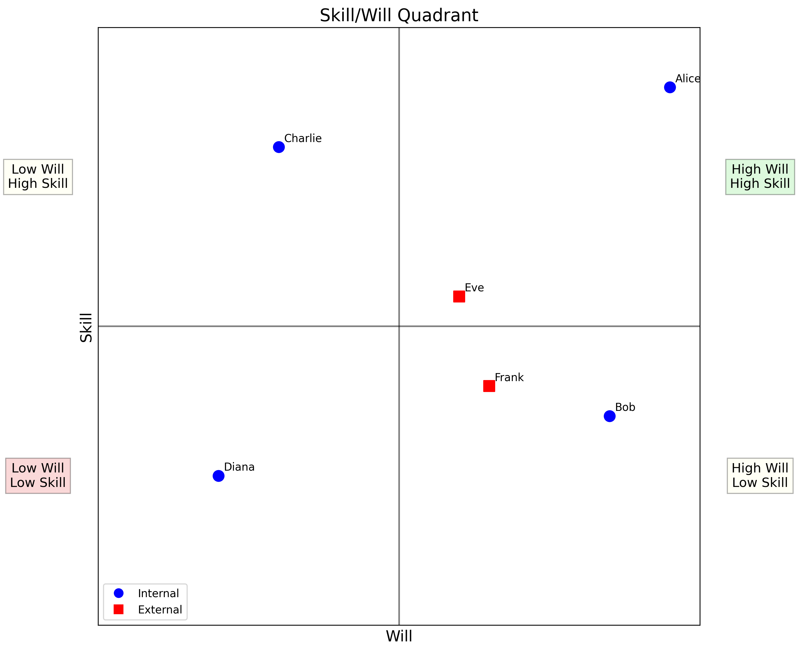
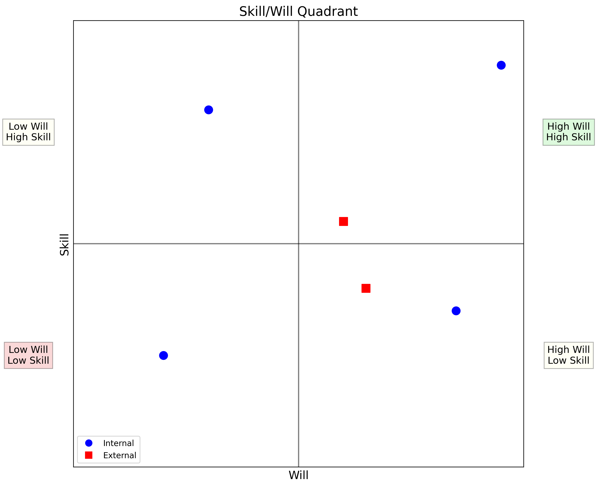

# Skill/Will Quadrant Generator

A Python tool that generates a visual representation of team members based on their skill level and willingness to perform tasks.

## Overview

The Skill/Will Quadrant is a management tool that plots team members on a graph with four quadrants:

- **High Skill/High Will** (top right)
- **High Skill/Low Will** (top left)
- **Low Skill/High Will** (bottom right)
- **Low Skill/Low Will** (bottom left)

The application generates two versions of the chart:

1. A chart including employee names
2. A chart with only data points (anonymous)

### CSV Format

Create a CSV file with the following columns:

1. Name - Employee/team member name
2. Skill Score - A number between -100 and 100
3. Will Score - A number between -100 and 100
4. Is Internal - "True"/"False", "Yes"/"No", "1"/"0", or "Internal"/"External"

Example:

```
Name,Skill,Will,IsInternal
Alice,80,90,True
Bob,-30,70,True
Charlie,60,-40,True
Diana,-50,-60,True
Eve,10,20,False
```

There is a sample csv file that you can modify under `data/employees.csv`.

## Output

The script generates four files:

- `skill_will_quadrant_with_names.png` - PNG chart with employee names
- `skill_will_quadrant_with_names.pdf` - PDF chart with employee names
- `skill_will_quadrant_without_names.png` - PNG chart without employee names
- `skill_will_quadrant_without_names.pdf` - PDF chart without employee names

By default, files are saved to `/app/output/` when running in a Docker container, or to the current directory otherwise.

## Docker Support

The application includes both a Dockerfile and a docker-compose.yml file.

### Using Docker Compose

```bash
# Clone the repository
git clone https://github.com/selemis/skill-will-quadrant.git
cd skill-will-quadrant

# Create directories for data and output if they don't exist
mkdir -p data output

# Place your CSV file in the data directory as employees.csv
# Example: cp your_employee_data.csv data/employees.csv 

# Run the application using Docker Compose
docker-compose up --build
```

### Using Docker directly

```bash
# Clone the repository
git clone git@gitlab.interamerican.gr:omirous/skill-will-quadrant.git
cd skill-will-quadrant

# Build the Docker image
docker build -t skill-will-quadrant .

# Run with your own CSV data (data/employees.csv)
docker run -v $(pwd)/output:/app/output -v $(pwd)/data/employees.csv:/app/data/employees.csv skill-will-quadrant --csv /app/data/employees.csv

# Run with sample data (inside the skill_will_quandrant.py)
docker run -v $(pwd)/output:/app/output skill-will-quadrant
```

### Using Docker Compose

```bash
# Clone the repository
git clone git@gitlab.interamerican.gr:omirous/skill-will-quadrant.git
cd skill-will-quadrant

# Create directories for data and output if they don't exist
mkdir -p data output

# Place your CSV file in the data directory as employees.csv
# Example: cp your_employee_data.csv data/employees.csv 

# Run the application using Docker Compose
docker-compose up --build
```

The docker-compose.yml file automatically:

- Builds the Docker image if needed
- Mounts the local `./data` directory to `/app/data` in the container
- Mounts the local `./output` directory to `/app/output` in the container
- Runs the script with the CSV file at `/app/data/employees.csv`

## Sample Output


### Quadrant with names



### Quadrant without names




## Requirements

-  Docker to run the containerized version
